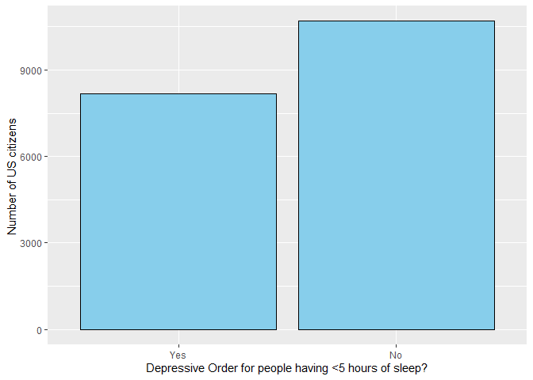
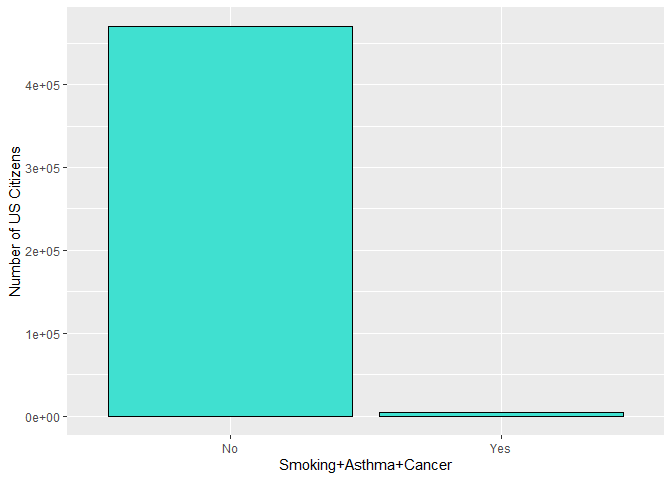
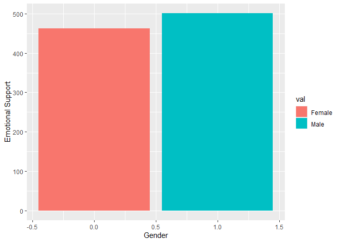
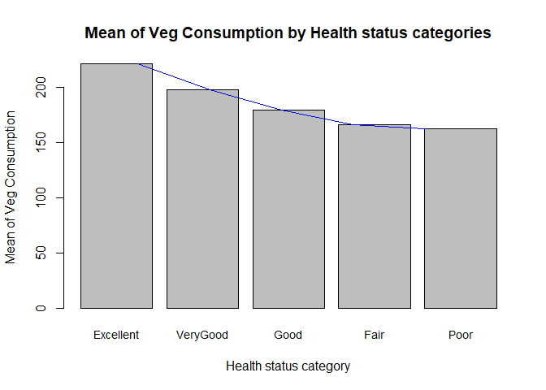
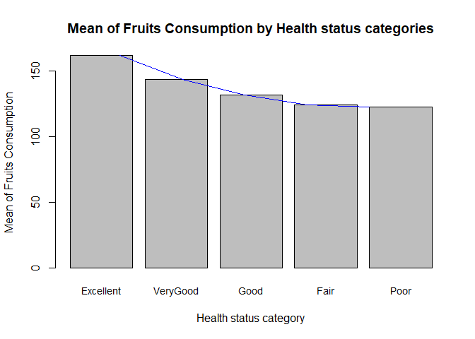
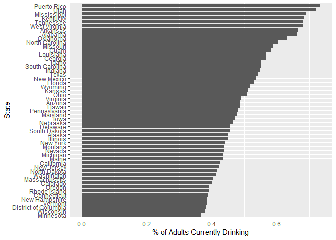

Setup
-----

### Load packages

    library(ggplot2)
    library(dplyr)

### Load data

    load('brfss2013.Rdata')

------------------------------------------------------------------------

Part 1: Data
------------

The behavioral Risk Factor Surveillance System (BRFSS) is a
collaborative project between all of the states in the United States(
US) and participating US territories and the Centers for Disease Control
and Prevention (CDC). It’s major objective is to collect uniform,
state-specific data on preventive health practices and risk behaviors
that are linked to chronic diseases, injuries, and preventable
infectious diseases that affect the adult population. Now we will dive
into some important aspects of our data.

1.  **What is our data about**?

Answer: Our data is a complete survey conducted by BRFSS regarding the
health status of the adult US citizens and their health related issues.
This data “brfss2013” provides the data of *491775* patients and total
of *330* variables are used as a metrics for evaluation. Actually, the
whole population was taken into account, however, this data provides
information for the US adult citizens. Hence, a sample is taken.

1.  **Why is this data collected**?

Answer: This data is helpful for BRFSS for studying and analyzing
several factors that are responsible for ill-health of adult US citizens
and to draw the meaningful insights from these data.

1.  **Mode of data collection**:

This data is conducted through survey. The survey was taken using
landline telephone and cellular telephone.

1.  *During landline telephone survey*, interviewers collected data from
    a randomly selected adult in a household. Disproportionate
    stratified sampling (DSS) has been used for the landline sample.

2.  *During cellular telephone survey*, interviewers collected data from
    an adult who participates by using a cellular telephone and resided
    in a private residence or college housing. The sample is randomly
    generated from a sampling frame of confirmed cellular area.

### Scope of inference

While talking about scope of inference, the BRFSS study is of
observational nature which employs stratified design based on random
sampling. Also, the survey must be generic to all non-institutionalized
adults (18 or more). This whole survey is a complete experimental study.

------------------------------------------------------------------------

------------------------------------------------------------------------

Part 2: Research questions
--------------------------

**Research question 1:**

One of the first research question involves how sleeping habit of an US
citizen have any effects on chronic health condition specifically
depressive disorder, specifically for those category of people who sleep
for less than 5 hours.

**Research question 2:**

My next research question involves seeing the relativity of the US
citizens who have smoked at least 100 cigarettes, had any asthma related
issues, and had other types of cancers too.

**Research question 3:**

Third research question is related to mental support based on gender.
There are many issues related to mentality in US that we get to hear via
News. So, I want to know if male get higher mental support and care than
female or vice-verse or maybe equal.

------------------------------------------------------------------------

Part 3: Exploratory data analysis
---------------------------------

**Research question 1:**

    #Selecting attributes of our interest i.e sleptim1(no of sleeping hours), addepev2(Yes/No) and removing the missing values
    sleep_depression <- brfss2013 %>%
      filter(!is.na(sleptim1),!is.na(addepev2)) %>%
      select(sleptim1,addepev2)
      
    up_depression<- sleep_depression %>%
      filter(sleptim1<5) %>%
      group_by(addepev2) %>%
      summarise(count=n())

    up_depression

    ## # A tibble: 2 x 2
    ##   addepev2 count
    ##   <fct>    <int>
    ## 1 Yes       8187
    ## 2 No       10697

    ggplot(data=up_depression,aes(x=addepev2,y=count))+
          geom_bar(stat="identity",color='black',fill='sky blue')+
          xlab("Depressive Order for people having <5 hours of sleep?")+
          ylab("Number of US citizens ")

**From the bar diagram**, we can see that people not having depressive
order even after having less than five hours of sleep is more than
people having depressive order under same condition which is I found,
quite, ***astounding***. This can visualise us an image that sleeping
disorder has less influence on depression. But again, we cannot
explicitly say that since it can be influenced by many other health
factors.

**Research Question 2:**

    sm_as_cr <- brfss2013 %>%
      filter(!is.na(smoke100),!is.na(asthma3),!is.na(chcocncr)) %>%
      select(smoke100,asthma3,chcocncr)

    sm_as_cr<- sm_as_cr %>%
      mutate(allyes= ifelse(smoke100=="Yes"& asthma3=="Yes" & chcocncr=="Yes","Yes","No"))

    all_yes<-sm_as_cr %>%
      group_by(allyes) %>%
      summarise(count=n())

    ggplot(data=all_yes,aes(x=allyes,y=count))+
          geom_bar(stat='identity', color ="black", fill="turquoise")+
          xlab("Smoking+Asthma+Cancer")+
          ylab("Number of US Citizens")

From the graph, we can say that those people who had smoked at least 100
times, had asthma too, and cancer related complications **are very
less** compared to those that do not have all these. From here, we can
estimate that there are very, very less people who are bounded with all
these critical health problems. From this, we can also guess that asthma
and cancer are not really caused by smoking. But again, we can’t
explicitly say anything since the sample can be influenced by many
factors such as habitat, financial status and many more.

**Research question 3:**

    life<- brfss2013 %>%
      filter(!is.na(lsatisfy),!is.na(emtsuprt),!is.na(cadult)) %>%
      select(lsatisfy,emtsuprt,cadult)

    life <- life %>%
      mutate(male= ifelse(cadult=="Yes, male respondent",1,0))

    gender_supp<- life %>%
      filter(lsatisfy=="Very satisfied" & emtsuprt=="Always") %>%
      group_by(male) %>%
      summarise(count=n())

    val=c("Female","Male")

    ggplot(data=gender_supp,aes(x=male,y=count,fill=val))+
          geom_bar(stat='identity')+
          xlab("Gender")+
          ylab("Emotional Support")

**From the bar graph**, we can clearly see that the number of males and
females are approximately equal. From this visualization, we can , to a
certain extent say that, male and female in US states get equal
emotional support. However, this is only acceptable form for the data
collected by BRFSS. It cannot be generalized to the whole population.
This can be influenced by many external factors.

**Research question 4:** Among non-institutionalized adults in the US,
is there any association between respondents’ health status and their
consumption of vegetables and fruits. It would be interesting to find
out how the health status category is affected by vegetable and fruits
intake.

    q2_a <- brfss2013 %>% filter(!is.na(genhlth), !is.na(X_vegesum), genhlth == 'Excellent') %>%
      summarise(mean_Excellent_veg = mean(X_vegesum))

    q2_b <- brfss2013 %>% filter(!is.na(genhlth), !is.na(X_vegesum), genhlth == 'Very good') %>%
      summarise(mean_VeryGood_veg = mean(X_vegesum))

    q2_c <- brfss2013 %>% filter(!is.na(genhlth), !is.na(X_vegesum), genhlth == 'Good') %>%
      summarise(mean_Good_veg = mean(X_vegesum))
    q2_d <- brfss2013 %>% filter(!is.na(genhlth), !is.na(X_vegesum), genhlth == 'Fair') %>%
      summarise(mean_Fair_veg = mean(X_vegesum))
    q2_e <- brfss2013 %>% filter(!is.na(genhlth), !is.na(X_vegesum), genhlth == 'Poor') %>%
      summarise(mean_Poor_veg = mean(X_vegesum))
    q2_f <- brfss2013 %>% filter(!is.na(genhlth), !is.na(X_frutsum), genhlth == 'Excellent') %>%
      summarise(mean_Excellent_fruit = mean(X_frutsum))
    q2_g <- brfss2013 %>% filter(!is.na(genhlth), !is.na(X_frutsum), genhlth == 'Very good') %>%
      summarise(mean_VeryGood_fruit = mean(X_frutsum))
    q2_h <- brfss2013 %>% filter(!is.na(genhlth), !is.na(X_frutsum), genhlth == 'Good') %>%
      summarise(mean_Good_fruit = mean(X_frutsum))
    q2_i <- brfss2013 %>% filter(!is.na(genhlth), !is.na(X_frutsum), genhlth == 'Fair') %>%
      summarise(mean_Fair_fruit = mean(X_frutsum))
    q2_j <- brfss2013 %>% filter(!is.na(genhlth), !is.na(X_frutsum), genhlth == 'Poor') %>%
      summarise(mean_Poor_fruit = mean(X_frutsum))
    mean_veg_vector_health <- c(q2_a$mean_Excellent_veg, q2_b$mean_VeryGood_veg, q2_c$mean_Good_veg,
                             q2_d$mean_Fair_veg, q2_e$mean_Poor_veg)
    names <- c("Excellent", "VeryGood", "Good", "Fair", "Poor")
    barplot(mean_veg_vector_health, names.arg = names, cex.names = .9, xlab = "Health status category",
            ylab = 'Mean of Veg Consumption', main= 'Mean of Veg Consumption by Health status categories')
    lines(mean_veg_vector_health, col = 'Blue')

    mean_fruit_vector_health <- c(q2_f$mean_Excellent_fruit, q2_g$mean_VeryGood_fruit, q2_h$mean_Good_fruit,
                               q2_i$mean_Fair_fruit, q2_j$mean_Poor_fruit)
    barplot(mean_fruit_vector_health, names.arg = names, cex.names = .9, xlab = "Health status category",
            ylab = 'Mean of Fruits Consumption', main = 'Mean of Fruits Consumption by Health status categories')
    lines(mean_fruit_vector_health, col = 'Blue')

We can see that “Excellent” health people consume relatively more fruits
& vegetables. On the average, “Poor” health people consume less fruits &
vegetables. This relation of fruit & vegetable consumption with the
health status category is not causal.

**Research Question 5 :**

Among non-institutionalized adults in the US, which state has the
highest prevalence of adults drinking alcoholic beverages? In each state
and US territory, we compare the percentage of respondents who currently
drinking alcoholic beverages.

The variable drnkany5 documents adults who drink alcoholic beverages in
the past 30 days: it takes the value “Yes” for a respondent who had at
least one drink of alcohol in the past 30 days, and “No” for a
respondent who had not drink any alcohol in the past 30 days. Let’s
examine the values of drnkany5:

    q3 <- brfss2013 %>% select(X_state, drnkany5) %>% na.omit()
    q3 %>% group_by(drnkany5) %>% summarize(count = n())

    ## # A tibble: 2 x 2
    ##   drnkany5  count
    ##   <fct>     <int>
    ## 1 No       235417
    ## 2 Yes      236711

    q3  <- q3 %>% mutate(drnkany5 = ifelse(drnkany5 == "Yes", 1, 0))
    drinkers_by_state <- q3 %>%
      filter((X_state != 0) & (X_state != 80)) %>% # Filter out extraneous X_state values
      group_by(X_state) %>%
      summarize(fraction_current_drinkers = mean(drnkany5, na.rm = TRUE)) %>%
      arrange(desc(fraction_current_drinkers))
    drinkers_by_state %>% ggplot(aes(x = reorder(X_state, fraction_current_drinkers), y = fraction_current_drinkers)) +
      geom_col() + coord_flip() + xlab("State") + ylab("% of Adults Currently Drinking")

We observed that the top 5 states with the highest drinking rate are
Puerto Rico, Utah, Mississippi, Kentucky, and Tennessee (in descending
order), and the top 5 states with the lowest drinking rate are
Minnesota, Wisconsin, District of Columbia, Vermont, and New Hampshire
(in ascending order).
